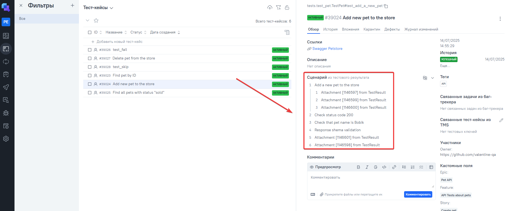

# Petstore API Autotesting project

><a target="_blank" href="https://petstore.swagger.io/">Swagger Petstore</a>
> 

---
### Check list of autotests
1. Creating a new pet.
2. Finding a pet by ID.
3. Finding a pet by status.
4. Deleting a pet.

---

### Used Tools
`

---

### Run autotests with Jenkin
> [Link on task in Jenkins](https://jenkins.autotests.cloud/job/Pet_store_API_autotests/)

#### To run autotests in Jenkins
Open [task in Jenkins](https://jenkins.autotests.cloud/job/zmamedov-qa_guru_Petstore_api_test/)  
1. (Username/password for authorization in Jenkins: valentine_guest/valentine_guest)

2. Click "**Build Now**".

---

### Allure report

#### Overall result

---
#### Test results with logs

#### Graphics

### Integration Jenkins with Allure TestOps
(Login/password: allure8/allure8)
> [Dashboard with general results](https://allure.autotests.cloud/project/4839/dashboards)

> [Test-cases](https://allure.autotests.cloud/project/4839/test-cases/39024?treeId=0)

---

### Integration Jenkins with Jira
> [Tasks in Jira](https://jira.autotests.cloud/browse/HOMEWORK-1234)
 (Login/password: jira8/jira8) 
 

---

### Telegram Alerts
> [Telegram bot link](https://t.me/valentine_qa_alerts) 
> 
